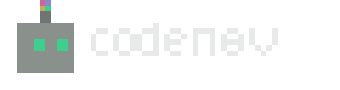
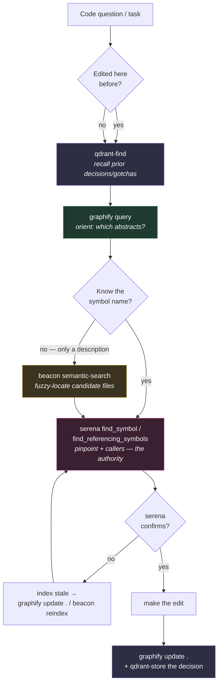
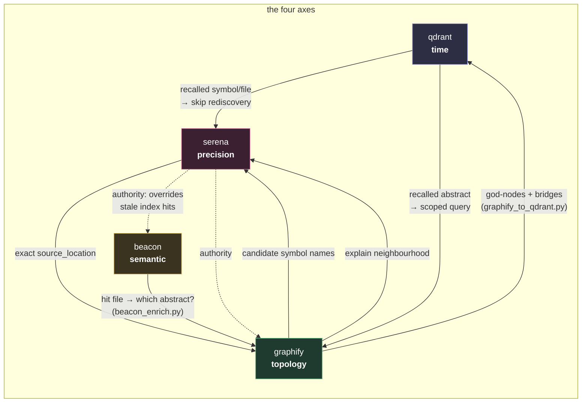

[](https://github.com/DKeken/codenav/actions/workflows/tests.yml)

A four-axis code-navigation combine for AI coding agents. It binds four persistent
tools — **qdrant**, **graphify**, **beacon**, **serena** — into one doctrine so an agent
orients before editing, locates code by meaning, recalls prior decisions, and feeds each
finding back so the tools sharpen one another.

This is **not** a new MCP server. It is a skill (doctrine) plus glue scripts. graphify is a
CLI; serena/beacon/qdrant are MCP tools the agent already has. codenav tells the agent how to
chain them and ships the shell-runnable connective tissue.

## The four axes

| Tool | Axis | Question it answers | Authority |
|---|---|---|---|
| qdrant | time | what did we decide / break / learn before? | the diary |
| graphify | topology (macro) | how does it all connect, where are hubs & bridges? | the map |
| beacon | semantic retrieval | find the code by meaning — name unknown | the front door |
| serena | precision (micro), live | where EXACTLY, who references it? | the scalpel |

Each owns a different axis. graphify and serena assume you know a name; beacon is the entry
when you only have a description; qdrant is the only one that crosses sessions; serena is the
only one that reads live source. Used in order they collapse "I don't know this codebase" into
a precise edit with minimal token burn.

## Pipeline

```
1. qdrant-find "<keywords>"      recall prior context (skip on trivial lookups)
2. graphify query "<question>"   orient by topology — which abstracts are involved
3. beacon semantic-search        fuzzy-locate files when the symbol name is unknown
4. serena find_symbol /          pinpoint exact symbol + callers (the authority)
   find_referencing_symbols
5. grep / Glob                   last resort
6. after change: graphify update .   +   qdrant-store the decision/gotcha
```

You don't always run all five — see `skills/codenav/SKILL.md` for the decision rule.



## How they complement each other

- **graphify → qdrant**: `scripts/graphify_to_qdrant.py` emits god-nodes, cross-abstract
  bridges and the abstract map as qdrant-store-ready facts (`kind: architectural-fact`). A
  future session recalls the topology without rebuilding.
- **beacon → graphify**: `scripts/beacon_enrich.py` takes a beacon hit's file path and reports
  which abstract it lives in and what it bridges to — a flat hit becomes a situated one.
- **serena ↔ graphify**: `serena find_symbol` gives the exact location; `graphify explain`
  gives the neighbourhood. Micro and macro views of the same node.
- **fan-out**: `scripts/locate.sh "<concept>"` runs graphify now and prints the exact beacon +
  serena calls for the agent to merge.

Each tool's output sharpens another's input — the combine is a cycle, not a one-way pipe:



## Install

### As a Claude Code plugin (recommended)

This repo is a self-hosting plugin marketplace. From Claude Code:

```
/plugin marketplace add DKeken/codenav
/plugin install codenav@codenav
```

Then invoke the doctrine with `/codenav:codenav`. The skill and glue scripts come with it.

### Manual (any agent)

Drop the skill where your agent loads skills (Claude Code: `~/.claude/skills/codenav/`):

```bash
cp -r skills/codenav ~/.claude/skills/codenav
```

Make scripts runnable and call them from your repo root (where `graphify-out/graph.json` lives):

```bash
chmod +x scripts/*.sh scripts/*.py
python3 scripts/graphify_to_qdrant.py --project <name> --skip-barrels  # emit architectural facts
python3 scripts/beacon_enrich.py --file <path>           # situate a beacon hit
bash    scripts/locate.sh "<fuzzy concept>"              # fan-out locate
```

`--skip-barrels` drops `index.ts` / `__init__.py` re-export files from the god-node list so
the signal is real abstractions, not structural plumbing. Barrels that remain (in bridges) are
disambiguated by parent dir (`index.ts (deps)`) instead of collapsing into one fake node.

`recluster.py` self-bootstraps: if `graphify`/`networkx` aren't importable under the launching
python, it re-execs under the interpreter graphify recorded at build time
(`graphify-out/.graphify_python`). So a bare `python3 recluster.py` works regardless of where
graphify is installed.

## Tests

Stdlib only, no graphify install needed (the functions under test are pure):

```bash
python3 tests/test_glue.py
```

Covers barrel disambiguation, `--skip-barrels`, the bridge metric (own + reached communities),
and beacon_enrich's three outcomes: full-path resolve, ambiguous bare filename (reports
candidates instead of silently merging), and unknown file.

### Wiring the four tools

- **graphify** — `pip install graphifyy` (or `uv tool install graphifyy`). Build the graph
  once: `graphify .` then `graphify update .` after changes. Optional `graphify --mcp` exposes
  it over MCP.
- **serena** — the serena MCP server (symbol search over your repo). No model needed; it runs a
  language server over your code.
- **beacon** — the hybrid (semantic + keyword + BM25) code-search MCP. **Semantic search needs a
  running embedding backend.** Out of the box beacon points at a local **Ollama**:

  ```bash
  # 1. install + run Ollama, then pull the default embedding model
  ollama pull nomic-embed-text          # 768-dim, what beacon expects by default
  ollama serve                          # serves http://localhost:11434

  # 2. index your repo, then sanity-check
  /beacon:reindex                       # first full index (one-time, then incremental)
  /beacon:index-status                  # file/chunk count, last sync
  ```

  Beacon's defaults: provider `ollama`, model `nomic-embed-text`, endpoint
  `http://localhost:11434/v1`, 768 dims, hybrid chunking (512 tok, 50 overlap). Config lives in
  `.claude/beacon.json`; change a setting with `/beacon:config set <key> <value>`.

  **Don't want to run Ollama?** Switch the provider — each has different dims, so a reindex is
  forced when you switch:

  | provider | model | dims | needs |
  |---|---|---|---|
  | `ollama` (default) | `nomic-embed-text` | 768 | local Ollama, no key |
  | `openai` | `text-embedding-3-small` | 1536 | `OPENAI_API_KEY` |
  | `voyage` | `voyage-code-3` | 1024 | Voyage key |
  | `litellm` | `voyage-code-3` | 1024 | a LiteLLM proxy (Vertex/Bedrock/…) |

  ```bash
  /beacon:config provider openai        # then set OPENAI_API_KEY, confirm the reindex prompt
  ```

  If you skip beacon entirely, codenav still works — you lose the "find by meaning when the
  symbol name is unknown" step and fall back to graphify-orient → serena-pinpoint.
- **qdrant** — the qdrant MCP with a persistent collection for cross-session memory. Point it at a
  local or hosted Qdrant; codenav tags every fact with `metadata.project` so memories stay
  per-repo retrievable.

codenav reads no API keys of its own — it orchestrates whatever the session already has. The
only model dependency is **beacon's embedding backend** (Ollama by default); graphify (AST-only)
and serena (language server) need no model or key.

## Re-cluster: fixing community over-fragmentation

graphify's Louvain clustering on a sparse AST-only graph over-fragments — a well-layered
monorepo can split into hundreds of tiny communities. When the project already HAS a canonical
architecture, re-cluster by that taxonomy instead of by blind modularity:

```bash
python3 scripts/recluster.py --map taxonomy.example.py
```

`recluster.py` remaps every node into a project-defined abstract by its source path, then
regenerates `graph.json`, the report, and the HTML. On a 14k-node / 689-community graph this
collapsed to **39 clean abstracts** that mirror the real architecture (contracts, core, db:<ctx>,
api:<ctx>, web:<fsd-layer>, …). Copy `taxonomy.example.py`, edit the `classify()` function for
your repo's layout, and pass it with `--map`.

## Provenance

codenav was built and battle-tested on [AGONTS](https://ag0nts.xyz) — a multi-tenant
AI-teammate SaaS (hexagonal monorepo: `contracts → core → adapters → apps`, seven bounded
contexts). The 14k-node / 689→39 re-cluster numbers above are from its real codebase, and
`taxonomy.example.py` encodes its actual layer/context layout — copy it as a starting point if
your repo is shaped similarly. The doctrine exists because navigating a repo that size with grep
alone was the bottleneck; the four-tool combine is what replaced it.

## License

MIT
